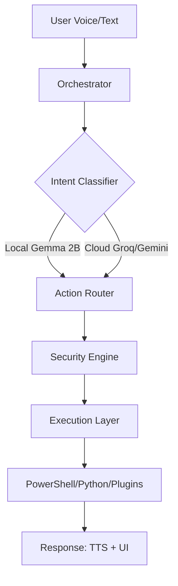

<p align="center">
  <h1 align="center">🧠 Jarvis v2.0</h1>
  <p align="center">
    <strong>The Autonomous OS Agent for Windows</strong>
  </p>
  <p align="center">
    Voice-Native · Hybrid-Cloud · SFT-Trained · Plugin-Extensible · Security-Hardened
  </p>
  <p align="center">
    <a href="#quickstart">Quickstart</a> •
    <a href="#key-capabilities">Capabilities</a> •
    <a href="#architecture">Architecture</a> •
    <a href="#sft-fine-tuning">SFT Pipeline</a> •
    <a href="#security-hardening">Security</a> •
    <a href="#api-fallback">API Cascade</a> •
    <a href="#roadmap">Roadmap</a>
  </p>
</p>

---

## What is Jarvis?

Jarvis is a **next-generation desktop OS agent** that transforms Windows into a voice-commandable, autonomous workspace. Unlike traditional chatbots, Jarvis lives in your system tray, listens for its wake word, and executes complex multi-step workflows across your local files, applications, and the web.

Built for the **RTX 2050 (4GB VRAM)** constraint, Jarvis uses a **Hybrid Intelligence** model: lightweight local models (Gemma 2B) for intent classification and simple tasks, and ultra-fast cloud APIs (Groq/Gemini) for complex reasoning and large-scale coding.

```powershell
You:     "Jarvis, find all PDF files in my Downloads from last week and move them to a new folder called 'Invoices'"
Jarvis:  Searching your Downloads... Found 4 PDFs. Creating 'Invoices' folder and moving files now.
         [EXEC] New-Item -ItemType Directory -Path "$home\Downloads\Invoices"
         [EXEC] Get-ChildItem "$home\Downloads\*.pdf" | Where-Object { $_.LastWriteTime -gt (Get-Date).AddDays(-7) } | Move-Item -Destination "$home\Downloads\Invoices"
         > Success: 4 files moved.
```

---

## Project Status (v2.0 Update)

> **Current Version:** 2.0.4  
> **Last Hardening:** March 5, 2026  
> **Status:** ✅ Production Ready / Security Audited

### Core Components

| Module | Purpose | Status |
|---|---|---|
| **SFT Brain** | Gemma 2B fine-tuned for reliable `[SHELL]` tag generation | ✅ Complete |
| **Hybrid Cascade** | 3-level STT & LLM fallback (Groq → Gemini → Local) | ✅ Complete |
| **Security Engine** | Safe PowerShell builders + path traversal protection | ✅ Hardened |
| **Plugin System** | Dynamic loading of external `.py` toolsets | ✅ Beta |
| **Multilingual** | Auto-detection & classification (English/Hindi/Mixed) | ✅ Working |
| **Memory Engine** | Persistent SQLite-backed long-term memory | ✅ Complete |

---

## Key Capabilities

### 🎙️ Hybrid-Cloud STT Pipeline
Jarvis features a **3-level cascade** for Speech-to-Text:
1.  **Groq (Whisper Large v3 Turbo)**: ~200ms latency (Default when quota available).
2.  **Gemini API**: Robust backup (~400ms).
3.  **Local Faster-Whisper**: Offline fallback (~800ms) for privacy and reliability.

### 🧠 SFT-Aligned Intent Engine
We fine-tuned **Gemma 2B** using QLoRA specifically for this project. The model is trained to:
-   Reliably produce `[SHELL]` and `[ACTION]` tags.
-   Identify **Risk Levels** (Low/Medium/High/Critical).
-   Self-block dangerous commands (e.g., `format c:`, `rm -rf`).
-   Ask for confirmation before executing high-impact system changes.

### 🛡️ Industrial-Grade Security
Phase 1 Hardening (March 2026) introduced:
-   **Safe PowerShell Builders**: Prevents string interpolation injection.
-   **Credential Redaction**: Automatically masks API keys in logs and terminal output.
-   **Path Normalization**: Blocks traversal attacks (`../../`) and system-critical directory access.
-   **Prompt Injection Protection**: Session-tokenized tag parsing.

### 🧩 Extensible Plugin Ecosystem
Add new capabilities without touching the core! Just drop a Python file into `Jarvis/plugins/`.
-   **Example**: `hello_example.py` adds a new "Greet" capability.
-   **System Tools**: Native support for VS Code, Browser, Spotify, and System Volume.

---

## Architecture

Jarvis follows a **3-Tiered OS Agent Architecture** designed for low latency and high reliability.



### Upgraded System Flow
1.  **Listener Thread**: Captures audio and routes through the STT cascade.
2.  **Orchestrator**: The "Brain" that coordinates between local SFT models and cloud APIs.
3.  **Action Router**: Dispatches tasks to safe PowerShell builders, native Python tools, or external plugins.
4.  **Security Validator**: The final gatekeeper that audits every command before execution.

---

## SFT Fine-Tuning Pipeline

Located in `Jarvis/sft/`, this pipeline allows you to re-train the brain for your specific needs:

1.  **Dataset Generation**: Expand our seed templates into thousands of varied examples.
2.  **QLoRA Training**: Train Gemma 2B on a single 8GB GPU (or RTX 2050 4GB with optimizations).
3.  **Evaluation**: Automated testing for tag validity and intent accuracy.

```bash
# Generate 500 new training examples
python -m Jarvis.sft.generate_dataset --out sft/train.jsonl --count 500

# Start QLoRA fine-tuning
python -m Jarvis.sft.train_qlora --data sft/train.jsonl
```

---

## Security Hardening

Jarvis v2.0 is built on the principle of **Zero Trust Shell Execution**.

| Feature | File | Description |
|---|---|---|
| **Safe Builders** | `powershell_safe.py` | Uses variable-bound execution instead of string formatting. |
| **Input Validation** | `security_validator.py` | Normalizes paths and validates application names. |
| **Masking** | `credential_protection.py` | Prevents leaking `GROQ_API_KEY` or `GEMINI_API_KEY` in logs. |
| **Injection Guard** | `prompt_injection_protection.py` | Validates that LLM-generated tags aren't trying to escape their sandbox. |

---

## Quickstart

### 1. Prerequisites
-   **Python 3.10+**
-   **Ollama** (for local model hosting)
-   **Groq/Gemini API Keys** (Optional but highly recommended for speed)

### 2. Setup
```powershell
# Clone the repository
git clone https://github.com/your-username/Antigravity.git
cd Antigravity

# Run the automated installer (handles venv and deps)
.\Setup.bat
```

### 3. Configure
Rename `.env.example` to `.env` and add your keys:
```env
GROQ_API_KEY=gsk_your_key_here
GEMINI_API_KEY=AIza_your_key_here
LLM_PROVIDER=groq
```

### 4. Launch
```powershell
.\run_jarvis.bat
```

---

## Roadmap

### ✅ Completed in v2.0
-   [x] **Fine-Tuning**: SFT Gemma 2B for command reliability.
-   [x] **Hybrid Cascade**: Automatic fallback between 3 LLM providers.
-   [x] **Security**: Full hardening of PowerShell and file system interactions.
-   [x] **Multilingual**: Native support for Hinglish (Hindi + English) interactions.

### 🚀 Upcoming (Phase 3)
-   [ ] **Vision Integration**: "Jarvis, look at my screen" (Local OCR + Gemini Vision).
-   [ ] **Mobile Bridge**: Control your PC from your phone via a secure relay.
-   [ ] **Workflow Engine**: Record and replay multi-step voice macros.
-   [ ] **Plugin Store**: Community-driven capability downloads.

---

## License
Proprietary. All rights reserved.

---
<p align="center">
  <i>"Efficiency is doing things right; effectiveness is doing the right things."</i>
</p>
