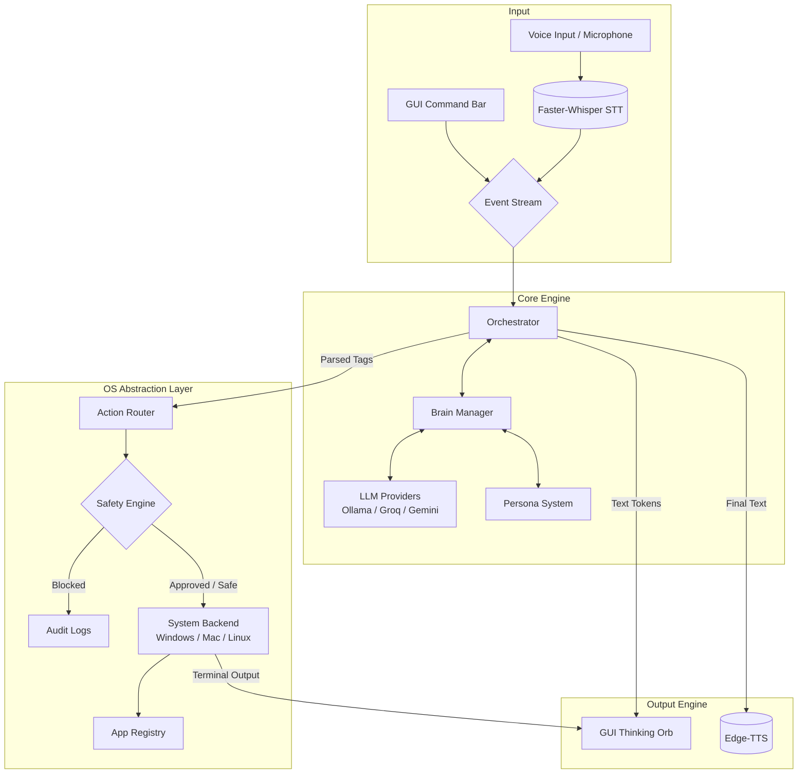
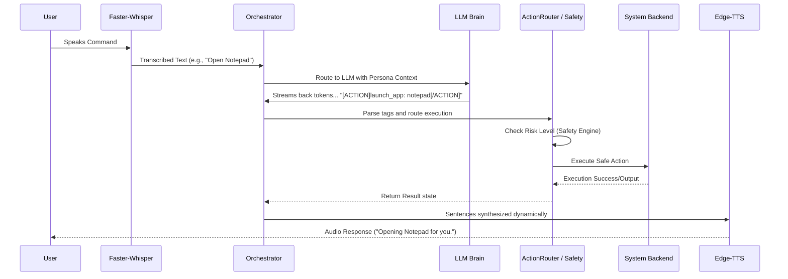

# Jarvis Architecture Overview

Jarvis is a local-first, autonomous AI assistant that runs directly on your machine. It can hear your voice, control your applications, manage files, and interact with the operating system without relying on cloud-based LLM execution for routing logic (when running smaller models via Ollama) or without internet connection constraints (when using Groq/Gemini local endpoints).

The project is built around a flexible **OS Abstraction Layer (OAL)** and controlled by a central **Orchestrator** that handles event streams, streaming LLM text output, tag parsing, and system invocation.

---

## 🏗️ System Architecture Flow

---

## 🔁 End-to-End Execution Flows

---

## 🧩 Core Components Breakdown

### 1. Main Entry & Concurrency (`main.py`)
The application entry point is built using `asyncio` and `PyQt6` hooks. It initializes the System Tray, the STT listener process in a background thread, the LLM Brain, and the PyQt UI. All component communication happens through PyQt `Signals` and thread-safe queues.

### 2. UI Layer (`Jarvis/ui/`)
Built natively in PyQt6 to ensure minimal overhead while offering rich animations.
- **`window.py` (Main Window)**: Contains the `ThinkingOrb` which visually shifts between states (idle, listening, processing). It also features the collapsible Terminal command input box and the live response log.
- **`tray.py` (System Tray)**: Keeps Jarvis active in the background, allowing the user to hide the main UI but keep the voice listener alive.
- **`components/`**: Houses visual components like the animated `ThinkingOrb` gradients.

### 3. Input & Output (`Jarvis/input/`, `Jarvis/output/`)
- **Speech-to-Text (`stt.py`)**: Uses the highly optimized `faster-whisper` library. Includes Voice Activity Detection (VAD) via `webrtcvad`. It records audio into a buffer when the user speaks, streams the chunk to Faster-Whisper, and forwards the transcript if it's confident it heard text.
- **Text-to-Speech (`tts.py`)**: Uses Microsoft's `edge-tts` to generate rapid, high-quality audio responses. Selected voices are deeply integrated with the `personas.py` definitions (e.g., British Assistant).

### 4. Orchestrator (`Jarvis/core/orchestrator.py`)
The brain stem of the project. It listens to transcripts from STT or raw strings from the UI command bar. 
- **Meta Commands**: It first checks if the user is triggering an internal command (like switching personas via `/persona witty`, or switching models via `/model gemma`).
- **Tag Parsing**: If it's a normal request, it asks the LLM for a response. As the response streams back, the orchestrator parses action brackets (`[ACTION]launch_app: notepad[/ACTION]`) or shell execution brackets (`[SHELL]echo hello[/SHELL]`).
- **Repetition Detector**: A built in guardrail that observes the stream and truncates it if local SFT models get stuck in generation loops.

### 5. The Brain & Personas (`Jarvis/core/brain.py`, `personas.py`)
Handles the context window, chat history, and the outgoing connections to the different completion endpoints (`Ollama`, `Groq`, `Gemini`).
- **`personas.py`**: A dynamic system that shapes the prompt and voice style at runtime based on the selected identity (Witty, Professional, Technical, etc.). It injects the specific tag instructions the currently loaded AI model was specifically fine-tuned for on the backend.

### 6. OS Abstraction Layer / OAL (`Jarvis/core/system/`)
Provides a safe, uniform way for the AI to invoke operating system actions regardless of whether the user is on Windows, Mac, or Linux. (Currently heavily optimized for Windows via `backend_win.py`).
- **`ActionRouter`**: Takes raw parsed `[ACTION]` tags and determines if it's an app request, a url open request, or system info query. It delegates `[SHELL]` tags immediately down to the SafetyEngine.
- **`SafetyEngine`**: An imperative layer that filters shell requests. 
  - Validates commands against deep regex `RiskPattern` lists. 
  - Prevents PowerShell encoded execution (`-enc`), piped exploits (`iex`), and limits API flooding (5 commands/10sec max).
  - Triggers the Confirmation Dialog on the main UI thread if `RiskLevel.HIGH` is reached (e.g. `shutdown`, `rm -rf`).
  - Audits all `CRITICAL` or `HIGH` calls to `logs/audit.jsonl`.
- **`AppRegistry`**: A smart mapping tool that fuzz-matches user app queries to physical executables. Examples: "word" -> "Microsoft Word", "vs" -> "Visual Studio Code".

### 7. Supervised Fine-Tuning SFT (`Jarvis/sft/`)
A completely local pipeline designed to forcefully bake the `[ACTION]` syntax into small models (e.g., 1.5B – 3B parameters) so they can run extremely fast locally via Ollama without getting confused by meta-commands.
- **Generation (`generate_dataset.py`)**: Procedurally generates thousands of varied templates targeting specific interaction modes (app launching, conversational, terminal hacking).
- **Evaluating**: (`eval_structured.py`): Validates the datasets precision.
- **Training**: (`train_qlora.py`): Leverages QLoRA to PEFT (Parameter-Efficient Fine-Tune) the models over several epochs.
- **Exporting**: (`export_to_ollama.py`): Safely compiles the adapter matrices and base bits into `.gguf` weights, assigns the specific system Modelfiles, and registers them directly into the user's Ollama runtime instantly.
